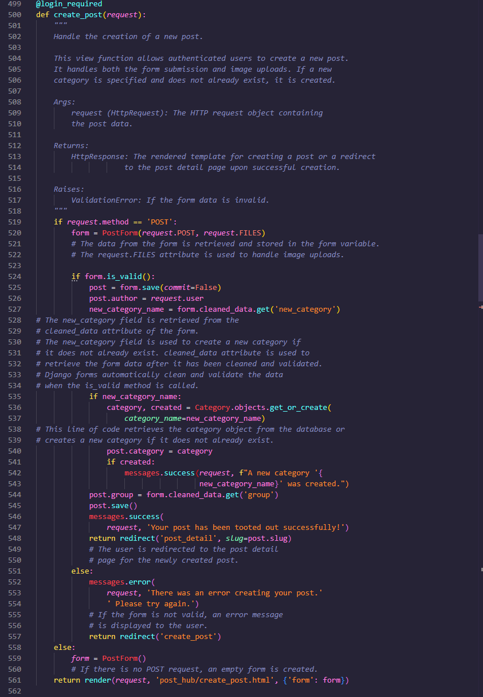
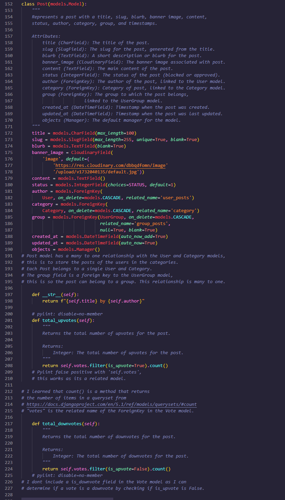

# Tooter | A Reddit-style Site

#### Total time on this project - 

#### Project board - https://github.com/users/MaxBWiseman/projects/2
#### Project link - https://project4-reddit-style-site-1a90f95428a8.herokuapp.com/

## Contents
* [Main Blurb](#main-blurb)
* [Target Audience](#target-audience)
* [User Experience](#user-experience)
* [Design Choices](#design-choices)
* [Features](#features)
    * [Future Implementations](#future-implementations)
* [Images](#images)
* [Testing](#testing)
    * [Testing Features](#testing-features)
    * [Testing UI](#testing-ui)
    * [User Testing](#user-testing)
* [Admin features](#admin-features)
* [Encountered Bugs](#encountered-bugs)
* [My Data Schema](#my-data-schema)
* [Agile Development](#agile-development)
* [Languages](#languages-that-were-used-for-this-project)
    * [Other Libraries Used](#other-libraries-used)
* [Deployment](#deployment)
    * [Clone The Repository](#how-to-clone-this-repository)
    * [How To Create A Fork](#how-to-fork-this-repository)
* [Credits](#credits)
    * [Creator](#creator)
    * [Media](#media)
    * [Acknowledgements](#acknowledgements)
    * [Link to Production Deployment](#link-to-production-deployment)
    * [More Words from Developer](#more-words-from-developer)

## Main Blurb

Tooter is a Reddit-style platform designed to bring people together to share their thoughts, ideas, and interests. My mission was to create a dynamic community where users can engage in meaningful discussions, share content, and discover new topics that inspire them.

- **Blog Posting**
  - Create with a sleek Summernote editor
  - Like or dislike posts
  - Edit or delete your content whenever
  - Elevate your post with a custom banner image
  - Create your own categorys or use an existing one
- **Commenting**
  - Give your opinion on any post
  - Express yourself and attach a image
  - Like or dislike comments
  - Reply to any comment to have a nested thread
  - Edit or delete your comments whenever
  - Even group chat boards!
- **Groups**
  - Have a scoped interest? Make a group about it!
  - Admin your own group and have other like-minded tooters join
  - Group chat board
  - Tag your posts in a group to showcase it within the group
- **Profiles**
  - Uppon account creation you are given you own profile
  - Upload a profile image
  - Customize with a biography and optional location
  - View your Tooter statisitics such as, post grade or comment grade
  - View posts, comments and groups you have interacted with, or another user has interacted with
  - View other users profiles by clicking on their name

## Target Audience

Tooter is designed for individuals who are passionate about sharing their thoughts, ideas, and interests in a dynamic online community. Whether you are a blogger looking to create engaging content with a sleek Summernote editor, a commenter who enjoys expressing opinions and participating in nested discussions, or someone with a specific interest looking to create and manage groups, Tooter offers a platform for you. Our target audience includes:

- **Bloggers and Content Creators**: Those who want to create, edit, and share posts with custom banner images and categories.

- **Active Commenters**: Users who enjoy engaging in discussions, liking or disliking comments, and participating in group chat boards.

- **Interest-Based Group Enthusiasts**: Individuals who want to create and manage groups around specific interests, and tag posts to showcase within the group.

- **Profile Customizers**: Users who want to personalize their profiles with images, biographies, and view their interaction statistics.

- *Community Seekers*: People looking to connect with like-minded individuals, discover new topics, and engage in meaningful discussions.

Tooter aims to provide a comprehensive platform for all these users, fostering a vibrant and interactive community.

## User Experience

Tooter offers a seamless and engaging user experience designed to foster community interaction and content sharing. Users can easily create and manage their posts using the sleek Summernote editor, allowing for rich text formatting and the addition of custom banner images. The platform's intuitive interface makes it simple to like, dislike, edit, or delete content, ensuring users have full control over their contributions.

Commenting on posts is straightforward, with features that allow users to express their opinions, attach images, and engage in nested discussions. The ability to like or dislike comments and participate in group chat boards enhances the interactive experience.

Groups provide a space for users with specific interests to connect and collaborate. Creating and managing groups is user-friendly, and group admins can facilitate discussions through dedicated chat boards. Posts tagged within groups are showcased, making it easy for members to stay updated on relevant content.

Profiles on Tooter are customizable, allowing users to upload profile images, write biographies, and specify their location. Users can view their interaction statistics, such as post and comment grades, and explore the profiles of others by clicking on their names. This personalized touch helps users build their online identity and connect with like-minded individuals.

## Design Choices

The design choices for Tooter were made with the goal of creating an engaging and visually appealing platform that caters to a wide range of user preferences. One of the key design features is the inclusion of both day mode and night mode, allowing users to choose the interface that best suits their viewing preferences. This flexibility ensures that Tooter can attract and retain users who have different visual comfort needs.

### Day Mode
The day mode of Tooter features a bright and vibrant color scheme with contrasting green colors. This design choice was made to create a fresh and inviting look that enhances readability and user engagement during daytime use. The green color palette is not only visually appealing but also helps to create a sense of energy and activity on the platform.

### Night Mode
For users who prefer a darker interface, Tooter offers a night mode with dark blue colors. This mode is designed to reduce eye strain and provide a comfortable viewing experience in low-light environments. The dark blue color scheme creates a calm and focused atmosphere, making it ideal for users who engage with the platform during the evening or night.

### Consistent and Intuitive Design
Both day and night modes maintain a consistent layout and design elements to ensure a seamless user experience. The use of clear typography, intuitive navigation, and well-organized content helps users easily find and interact with the features they need. The sleek Summernote editor, customizable profiles, and interactive group chat boards are all designed to be user-friendly and visually cohesive.

### Accessibility Considerations
Accessibility was a key consideration in the design process. The contrasting color schemes in both modes ensure that text and interactive elements are easily distinguishable. Additionally, the platform includes features such as aria-labels for buttons and other interactive elements to support users who rely on assistive technologies.

### Extra
The switch that alternates between day and night on the top right of the navbar is made entireley from HTML and CSS, I learned this in a JSconfrernce about using less JavaScript.
The change between day and night modes is JavaScript, but the switch itself is pure HTML and CSS which I think is pretty cool. Source - https://www.youtube.com/watch?v=IP_rtWEMR0o&t=438s

#### Day mode

#### Night mode

## Features

- **Blog Posting**
  - Create with a sleek Summernote editor
  - Like or dislike posts
  - Edit or delete your content whenever
  - Elevate your post with a custom banner image
  - Create your own categorys or use an existing one
- **Commenting**
  - Give your opinion on any post
  - Express yourself and attach a image
  - Like or dislike comments
  - Reply to any comment to have a nested thread
  - Edit or delete your comments whenever
  - Even group chat boards!
- **Groups**
  - Have a scoped interest? Make a group about it!
  - Admin your own group and have other like-minded tooters join
  - Group chat board
  - Tag your posts in a group to showcase it within the group
- **Profiles**
  - Uppon account creation you are given you own profile
  - Upload a profile image
  - Customize with a biography and optional location
  - View your Tooter statisitics such as, post grade or comment grade
  - View posts, comments and groups you have interacted with, or another user has interacted with
  - View other users profiles by clicking on their name

### Future Implementations

Tooter aims to continuously evolve and enhance the user experience by introducing new features and improvements. Here are some of the future implementations planned for the platform:

- **Video Posting**:

    Allow users to upload and share videos within their posts, providing a richer multimedia experience.
    Enable video playback directly within the platform, making it easy for users to engage with video content.

- **GIF Comments**:

    Introduce the ability to attach GIFs to comments, adding a fun and expressive way for users to interact.
    Provide a searchable GIF library to help users find the perfect GIF for their comment.

- **Navbar Search Bar**:

    Add a search bar to the navbar, allowing users to quickly find posts, groups, and users.
    Implement advanced search filters to help users narrow down their search results.

- **More Unique Widgets**:

    Develop and integrate additional widgets to enhance the user interface and provide more interactive elements.
    Examples include trending topics, recent activity feeds, and personalized content recommendations.

- **Add Friends to a Friends List**:

    Enable users to add other users as friends, creating a more connected and social experience.
    Provide notifications for friend requests and updates from friends.

- **More Group Admin Tools**:

    Expand the tools available to group admins, allowing for better management and moderation of groups.
    Features may include member management, content approval, and group analytics.

These future implementations are designed to further enrich the Tooter experience, making it a more versatile and engaging platform for all users. By continuously adding new features and improvements, Tooter aims to stay at the forefront of community-driven content sharing and interaction.

## Images

These images were taken throughout development and show the progression of this app
and to view the progress from wireframe to final design.
### Original wireframe

### Base template **before** final

### Base template final

### Comments section before final

### Comments section final

### Create post before final

### Create post final

### Post page before final

### Post page final

### User groups before final

### User groups final 

#### Group admin view

#### Group member view

### Profile before final

### Profile final

## Testing

All testing has been done through UnitTest at the end of every PBI that required it, here are a few for reference, 

### Profile test

### Edit post test

### Usergroup model test

### Vote test

### Post/Comment test

### Post/Comment form tests

### Testing features

| Test |Outcome  |
|--|--|
|Posting | Pass|
|Commenting | Pass|
|Nested commenting | Pass|
|Group creation | Pass|
|Group admin | Pass|
|Profile |Pass|
|Categories |Pass|
|User Auth |Pass|
|Edit post/comment |Pass|
|Delete post/comment |Pass|

### Testing UI

| Test |Outcome  |
|--|--|
|Widgets |Pass|
|Day/night switch |Pass|

### User testing

#### I let my mother have a go and found that...

| Test | Result |
|--|--|
|Account created easily| 100%|
|Post sent gracefully| 100%|
|Liked comment/post easily |100%|

## Admin features

#### Django Admin Features for Superusers

The Django admin interface provides a powerful and user-friendly way for superusers to manage the application's data and configurations. Here are some of the key features and customizations available in the Django admin interface for this project:

- **Post Management**
    -Rich Text Editing: The Post model is configured with the Summernote editor, allowing superusers to create and edit posts with rich text formatting.
    - List Display: The admin interface displays a list of posts with columns for the title, slug, status, and creation date.
    - Search Functionality: Superusers can search for posts by title, content, and category name.
    - Filtering: Posts can be filtered by status and creation date.
    - Slug Generation: The slug field is automatically populated based on the post title.
- **Comment Management**
    - Nested Comments: The Comment model is registered with the MPTTModelAdmin, enabling support for nested comments. This allows superusers to view and manage comments in a hierarchical tree structure.
    - List Display: The admin interface displays a list of comments with columns for the author, content, and creation date.
    Search Functionality: Superusers can search for comments by author and content.
    - Filtering: Comments can be filtered by creation date.
- **Category Management**
    - List Display: The admin interface displays a list of categories with columns for the category name and slug.
    - Search Functionality: Superusers can search for categories by name.
    - Slug Generation: The slug field is automatically populated based on the category name.
- **User Group Management**
    - List Display: The admin interface displays a list of user groups with columns for the group name, admin, and member count.
    - Search Functionality: Superusers can search for user groups by name and admin.
    - Member Management: Superusers can view and manage the members of each user group.
- **Profile Management**
    - List Display: The admin interface displays a list of user profiles with columns for the user, bio, and location.
    - Search Functionality: Superusers can search for profiles by user and bio.
- **Additional Features**
    - Custom Actions: Superusers can perform custom actions on selected items, such as bulk deleting posts or comments.
    - Inline Editing: Superusers can edit related items directly within the parent item's edit page, making it easier to manage complex relationships.

## Encountered Bugs

### UnitTest bug

I encountered a bug where my unittest couldent create a test database, this was fixed after removing the django-heroku library

### Voting bug

Some time when voting too fast, one users vote can go beyond 1, I have seen it on 3 once, but fixes itself when vote again due to how the view works. This was fixed 

### Nesting comments
Bugs with nesting comments, fixed with MPTT Models, Bug with "this field is required error" fixed by removing form reset jquery

### Post and group association

During development, association with posts to groups stopped working, after double checking the models relationships, I migrated again and this problem stopped.

#### Bugs were documented in my project here - 

https://github.com/users/MaxBWiseman/projects/2/views/7

- 
### Code Examples

#### Create post view

#### Post model

# My Data Schema

## Agile development

Throughout the development of this project, I employed Agile methodologies to ensure a flexible and iterative approach. I used a Kanban board to manage tasks, track progress, and maintain a clear overview of the project's status. This approach allowed me to prioritize tasks effectively, adapt to changes, and deliver incremental improvements.

### Kanban Board

The Kanban board was instrumental in organizing the development process. It included columns for tasks such as "To Do," "In Progress," "Review," and "Done." Each task was represented by a card that could be moved across columns as it progressed. This visual representation helped in identifying bottlenecks and ensuring a smooth workflow.

Here are a few snapshots of the Kanban board throughout the development:

#### Milestones/Iterations

The project was divided into several milestones and iterations, each with specific goals and due dates. This iterative approach allowed for continuous feedback and improvement, ensuring that the project stayed on track and met its objectives.

Here are some key milestones and iterations:

## Project updates

To keep track of progress and communicate updates, I used GitHub's project update feature. This feature, located at the top right of the project board under "Project Details," allowed me to document significant milestones, changes, and achievements throughout the development process.

I have placed a lot of updates here, which can be viewed quickly with this link: https://github.com/users/MaxBWiseman/projects/2/views/1?pane=info

Or look at some quick screenshots - 

## Languages and Frameworks that were used for this project

- **HTML**
- **CSS**
- **JavaScript**
- **Python**
- **Django**

### Other Libraries Used

- **Django AllAuth**: For authentication and user management.
- **Django Crispy Forms**: To style Django forms with Bootstrap.
- **Django MPTT**: For handling hierarchical data in models.
- **Django Summernote**: For rich text editing in forms.
- **Cloudinary**: For managing and storing media files.
- **Whitenoise**: For serving static files in production.
- **Gunicorn**: A Python WSGI HTTP Server for UNIX.
- **Pillow**: For image processing.
- **psycopg2**: PostgreSQL database adapter for Python.
- **python-dotenv**: For loading environment variables from a `.env` file.
- **requests-oauthlib**: For OAuth authentication.
- **PyJWT**: For JSON Web Token authentication.
- **spellchecker**: For spell checking functionality.

## Deployment

My project was deployed to heroku, being sure to include the correct dependencies such as having:

- **requirements.txt**
 - To declare all the programs libraries and modules
- **Procfile**
 - To specify how heroku should start the application
- **Whitenoise**
 - For loading static files
- **Gunicorn**
  -A Python WSGI HTTP Server for UNIX, used to serve the Django application in production.
- **Config Vars**
 -  Where sensitive information critical for this project should be kept

After confirming these, I connected my GitHub to the Deploy section on the heroku dashboard and deployed the main branch of my projects repository.

Deployment link - 

### How to clone this repository

To clone this repository, use the following command:

git clone https://github.com/yourusername/Project-4---Code-Institute.git

### How to fork this repository

To fork this repository, follow these steps:

Navigate to the repository on GitHub.

Click the "Fork" button at the top right of the page.

Select your GitHub account to fork the repository to.

## Credits

### Creator
This project was created by me, Max Wiseman

### Media

All media used in this project, including images, icons, and other visual assets, have been sourced from reputable and free-to-use platforms. The profile and banner images were uploaded and managed using Cloudinary, which provides secure and scalable media storage solutions. Icons used throughout the site are from Font Awesome, a popular icon library that offers a wide range of high-quality icons. Additionally, some images were sourced from Unsplash, a platform that offers a vast collection of free high-resolution photos. All media assets have been used in accordance with their respective licenses, and full credit is given to the creators and platforms that provided these resources.

### Acknowledgements

- **Code Institute**: For providing the educational resources and guidance that made this project possible.

- **Cloudinary**: For offering a robust and scalable media storage solution that greatly enhanced the functionality of this project.

- **Font Awesome**: For providing a comprehensive library of high-quality icons that improved the visual appeal of the site.

- **Unsplash**: For offering a vast collection of free high-resolution photos that were used to enhance the visual content of the site.

- **Django AllAuth**: For simplifying the implementation of authentication and user management features.

- **Django Crispy Forms**: For making it easy to style Django forms with Bootstrap.

- **Django MPTT**: For providing tools to handle hierarchical data in models.

- **Django Summernote**: For enabling rich text editing in forms.

- **Whitenoise**: For simplifying the process of serving static files in production.

- **Gunicorn**: For providing a reliable WSGI HTTP server for deploying the application.

- **Pillow**: For offering powerful image processing capabilities.

- **GitHub**: For providing a platform to host and collaborate on this project.

- **Heroku**: For offering a platform to deploy and manage the application in a production environment.

- **My Family and Friends**: For their unwavering support and encouragement throughout the development of this project.

Thank you all for your contributions and support. This project would not have been possible without you.

### Link to production deployment

https://project4-reddit-style-site-1a90f95428a8.herokuapp.com/

### More words from developer

This project is dedicated to my late nan who passed away on the 2nd of november 2024 during development.

May your memory live on enternally online.